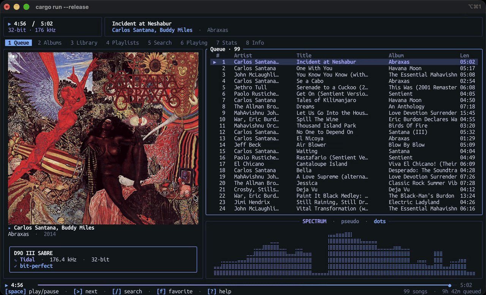
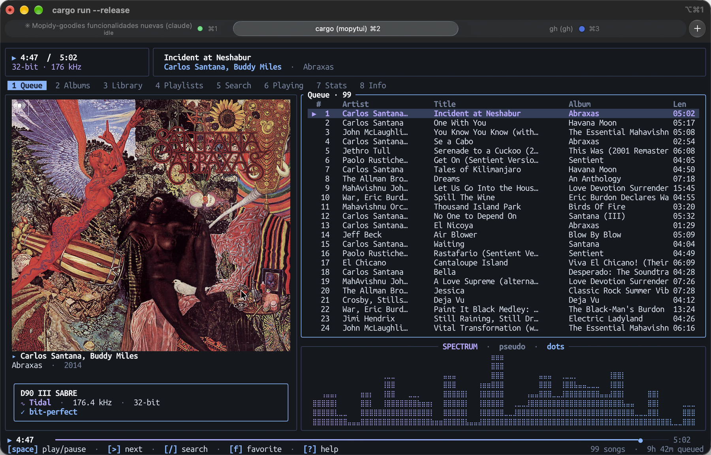
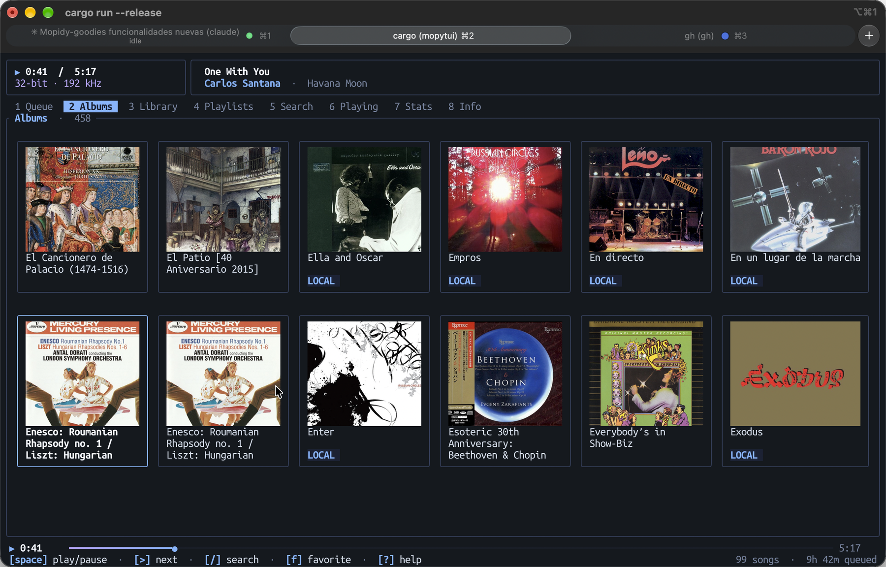
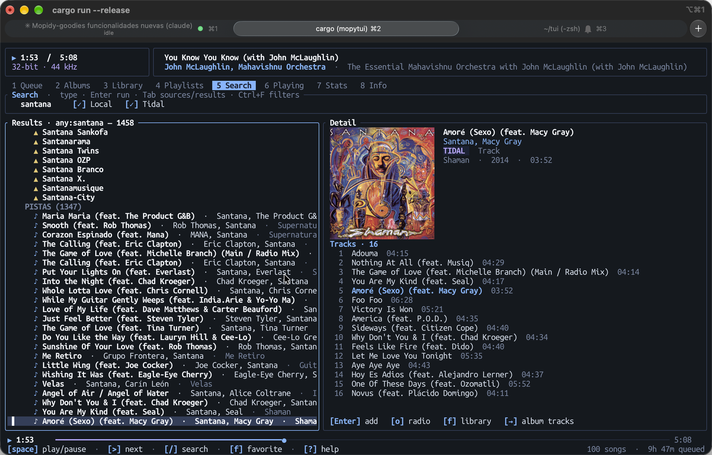
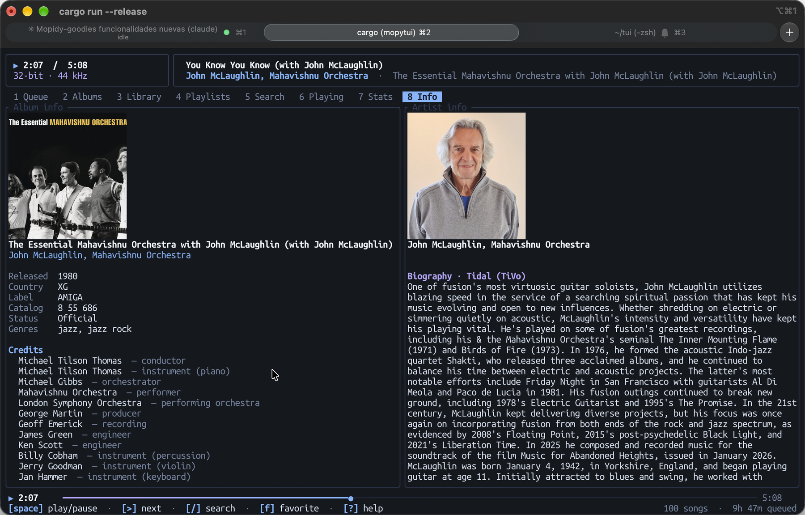
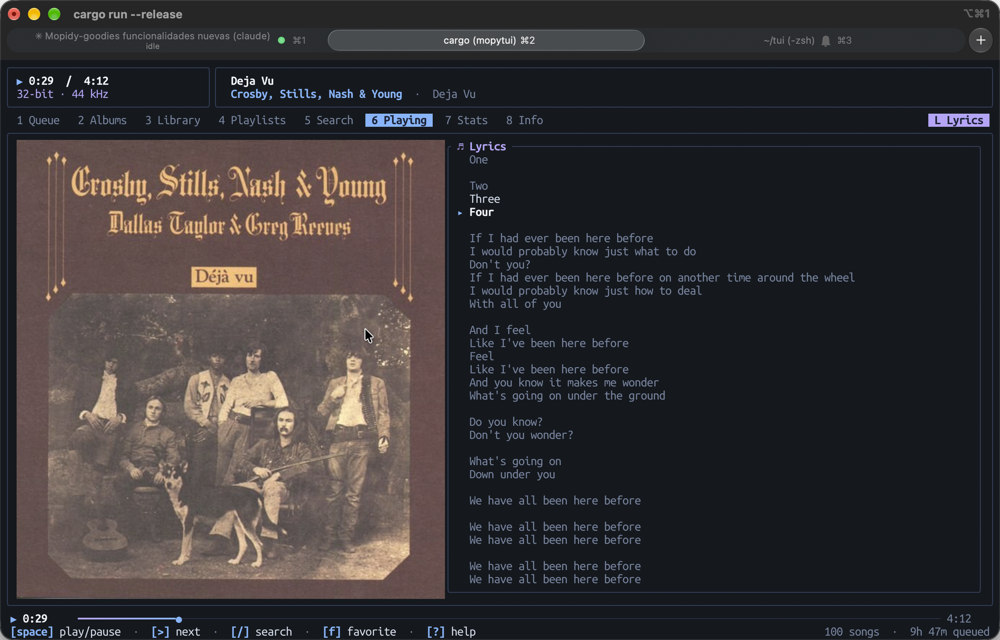

<h1 align="center">mopytui</h1>

<p align="center">
  
</p>

A full-featured terminal client for [Mopidy](https://mopidy.com/) — built
around the native JSON-RPC API so it surfaces everything `mopidy-mpd` does
*and more*, including Tidal browsing/search if the server has
[`mopidy-tidal`](https://github.com/tehkillerbee/mopidy-tidal) installed.

Renders cover art with the best protocol your terminal supports —
**Kitty graphics**, **iTerm2 inline images**, **Sixel**, or **unicode
halfblocks** — detected at runtime.

## Screenshots

<p align="center">
  
  
</p>
<p align="center">
  
  
</p>
<p align="center">
  
</p>

## Features

- **Albums grid** with real thumbnail covers (Spotify-style), with detail
  view showing tracks, MusicBrainz credits, and Wikipedia summary.
- Browse the entire Mopidy library tree (Local, Tidal, file-system,
  playlists, anything a backend exposes).
- Cross-source search (`core.library.search`) — local + Tidal together.
  Results are grouped under `TIDAL` / `LOCAL` and by albums · artists ·
  tracks; the highlighted one gets a detail panel with its cover, facts and
  track list (`→` to pick a track). Add albums to your Tidal library with
  `f`, play with `p`, queue with `a`, start a radio with `o`. `Ctrl+F` shows
  the advanced filters (artist, album, title, genre, date…).
- Queue management — add, reorder, remove, clear, shuffle.
- Playback control: play/pause/stop/next/prev/seek/volume/mute.
- All playback modes: random, repeat, single, consume.
- Stored playlists: list, load, delete; save the current queue as a playlist.
- **Cover art** in *Now Playing* and *Queue*, fetched via
  `core.library.get_images`, pre-resized to fill the panel cleanly and
  rendered via the best protocol your terminal supports.
- **Synced lyrics** from [lrclib.net](https://lrclib.net) with the active
  line highlighted in real time (toggle with `L`).
- **Audio chip** — live sample rate / bit depth / channels from
  `mopidy-mpd`'s `status:audio` (bit-perfect verification).
- **Tidal Goodies** stats (recently played, most played, top artists/albums,
  record labels, listening heatmap, genres, totals — filterable by week /
  month / year), **Tidal radio** (`o` on any track or artist) and **Tidal
  review, artist bio & track credits** in the Info view (for Tidal tracks and for local
  albums goodies can match to Tidal; preferred over Wikipedia, and the bio's
  picture is the artist avatar when no fanart.tv key is set) when the server
  has [`mopidy-tidal-goodies`](https://github.com/yaragon/mopidy-tidal-goodies)
  installed.
- Live updates via `mpd` `idle` subscription (player/mixer/options/playlist).

## Requirements

- A reachable Mopidy server with `mopidy-http` (always on by default) and
  `mopidy-mpd` enabled.
- Rust 1.86+ (uses 2024 edition, let-chains).
- A terminal. For best visuals, use one with **Kitty graphics**, **iTerm2
  inline images**, or **Sixel** support:
  - Kitty, WezTerm, Ghostty → Kitty graphics (recommended — no flicker on
    multi-image grids)
  - iTerm2 → iTerm2 inline images (works, but multi-image grids may flicker
    because the protocol re-emits the full PNG on every redraw)
  - foot, mlterm, Windows Terminal → Sixel
  - Everything else → unicode halfblocks (always works)

## Build & run

```sh
cargo build --release
./target/release/mopytui

# remote server
./target/release/mopytui --host 192.168.1.10 --port 6680
# shorthand
./target/release/mopytui 192.168.1.10:6680
# pick a theme on the fly
./target/release/mopytui --theme solar

./target/release/mopytui --help    # show all flags
```

For better halfblocks rendering on terminals without native image protocols,
opt in to `chafa` (requires `libchafa`):

```sh
# macOS
brew install chafa
# Linux (Debian/Ubuntu)
sudo apt install libchafa-dev

cargo build --release --features chafa
```

## Configuration

Edit `~/.config/mopytui/config.toml` (or the platform-equivalent under
`directories::ProjectDirs`):

```toml
host = "127.0.0.1"
http_port = 6680
mpd_port = 6600
theme = "midnight"  # midnight | soft-dark | daylight | solar
mpris = false       # Linux only
```

## Keyboard shortcuts

| Where     | Key                | Action                                  |
| --------- | ------------------ | --------------------------------------- |
| Global    | `q`                | Quit                                    |
|           | `?`                | Toggle help                             |
|           | `1`..`8`           | Queue · Albums · Library · Playlists · Search · Playing · Stats · Info |
|           | `Tab`              | Cycle views                             |
|           | `Ctrl+r`           | Refresh playback/queue/modes            |
|           | `L`                | Toggle synced lyrics panel (Now Playing) |
|           | `c`                | Toggle cover fit ↔ crop                 |
| Playback  | `Space`            | Play / pause                            |
|           | `s`                | Stop (outside Library/Search)           |
|           | `>`                | Next track                              |
|           | `<`                | Previous track                          |
|           | `[` / `]`          | Seek −/+ 10s                            |
|           | `←` / `→` (NP)     | Seek −/+ 5s                             |
|           | `-` / `+` / `=`    | Volume −/+ 5                            |
|           | `m`                | Toggle mute                             |
|           | `R` `T` `S` `C`    | Toggle random / repeat / single / consume |
|           | `o`                | Start Tidal radio from the selected / current track or artist, replacing the queue (needs goodies) |
| Albums    | `↑↓←→` / `hjkl`    | Move selection in the grid              |
|           | `PgUp` / `PgDn`    | Jump 3 rows                             |
|           | `Enter`            | Open album detail                       |
|           | `p`                | Play this album (replace queue)         |
|           | `a`                | Add album to queue                      |
|           | `f`                | Add / remove the album to / from your Tidal library |
|           | `r`                | Reload album collection                 |
|           | `Esc` / `Backspace`| Back to grid (from detail)              |
| Library   | `↑↓` / `jk`        | Move selection                          |
|           | `Enter`            | Open directory · open album · add track |
|           | `Backspace` / `h`  | Go up                                   |
|           | `Tab`              | Switch focus entries ↔ tracks           |
|           | `a` / `A`          | Add to queue (`A` = play after add)     |
|           | `r`                | `core.library.refresh` on selection     |
|           | `/`                | Open search                             |
| Search    | `/`                | Edit the query                          |
|           | `Enter` (editing)  | Run the search; focus moves to the results |
|           | `Ctrl+F`           | Show / hide the advanced filters        |
|           | `Esc`              | Leave edit mode                         |
|           | `Enter` (results)  | Add track · open album · browse artist  |
|           | `j` / `k`          | Move over results (grouped by Tidal / Local and by albums · artists · tracks) |
|           | `→` / `l` / `Tab`  | Move into the detail's track list (`←` / `h` / `Esc` back); `Enter` adds the track |
|           | `p` (album row)    | Play album                              |
|           | `a` (album row)    | Queue album                             |
|           | `f` (album / track row) | Add / remove the album to / from your Tidal library |
| Queue     | `↑↓` / `jk`        | Move selection                          |
|           | `Enter`            | Play this entry                         |
|           | `d` / `Del`        | Remove                                  |
|           | `J` / `K`          | Move down / up                          |
|           | `X`                | Clear                                   |
|           | `Z`                | Shuffle                                 |
|           | `f`                | Add / remove the selected track's Tidal album to / from your library |
| Stats     | `h` / `l`          | Previous / next tab                     |
|           | `p`                | Cycle period: all time · week · month · year |
| Playlists | `Enter` (list)     | Open playlist                           |
|           | `Enter` (tracks)   | Add track to queue                      |
|           | `a` (list)         | Add whole playlist to queue             |
|           | `D`                | Delete playlist                         |

## Themes

Pick at startup with `--theme <name>`:

- `midnight` (default) — analogous blue/violet palette anchored on
  periwinkle, warm amber reserved for the favorite star.
- `soft-dark` — neutral greys with soft blue accents.
- `daylight` — light theme.
- `solar` — Solarized-style.

All themes use 24-bit truecolor (16M colours), so make sure your terminal
has truecolor support.

## Logs

mopytui writes a debug log to the platform cache directory:

- macOS:  `~/Library/Caches/mopytui/mopytui.log`
- Linux:  `~/.cache/mopytui/mopytui.log`

Override the level with `RUST_LOG=mopytui=debug`. Useful targets:

- `mopytui::lyrics=debug` — lrclib lookups (artist, title, HTTP status, errors)
- `mopytui::mopidy=debug` — JSON-RPC traffic
- `mopytui::mpd=debug` — MPD `idle` events

## License

MIT — see [LICENSE](LICENSE).
